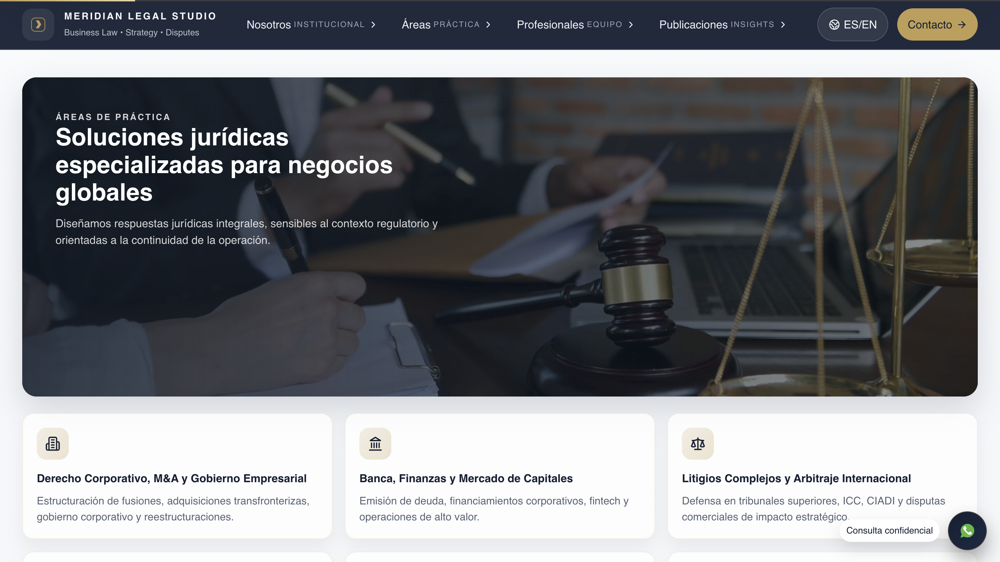

# MERIDIAN LEGAL STUDIO - Plataforma Web Corporativa

[](https://reactjs.org/)
[](https://shrink.me/CSS3)
[](https://developer.mozilla.org/es/docs/Web/HTML)

## Descripcion General del Desplazamiento y Navegacion

La interfaz web presenta una experiencia de navegacion continua y fluida disenada bajo principios de arquitectura moderna. El desplazamiento vertical integra transiciones suaves entre secciones institucionales, destacando elementos visuales clave como encabezados fijos con transparencia, tarjetas interactivas de servicios y ventanas modales flotantes que mantienen el contexto operativo del usuario en todo momento. La disposicion visual optimiza la jerarquia de informacion para brindar respuestas inmediatas ante la consulta de servicios legales corporativos.

---

## Capturas de la Interfaz

### Seccion Principal y Propuesta de Valor


La vista inicial exhibe un diseño de impacto visual con un encabezado institucional navegable y un area de bienvenida con fondo tematizado. Destacan los botones de accion para la consulta especializada y exploracion de areas, un selector de idioma, acceso directo a contacto y una llamada a la accion flotante para consultas confidenciales.

---

### Seccion de Areas de Practica



Esta vista presenta el catalogo de soluciones juridicas mediante una distribucion en reticula con tarjetas categorizadas. Se aprecian especialidades en Derecho Corporativo, Banca y Finanzas, y Litigios Complejos, acompañadas de una seccion destacada con fondo oscuro que resume la orientacion estrategica de la firma.

---

### Modal Perfil Profesional


La interfaz incluye un componente modal superpuesto para visualizar la biografia ejecutiva de los socios del bufete. Muestra una fotografia de alta resolucion, trayectoria academica, especializaciones tecnicas y un boton directo de contacto via correo electronico institucional.

---

## Estructura del Proyecto

```text
.
├── capturas_del_proyecto/
│   ├── imagen_1.jpg
│   ├── imagen_2.jpg
│   └── imagen_3.jpg
├── src/
│   ├── components/
│   ├── styles/
│   └── App.jsx
└── README.md
